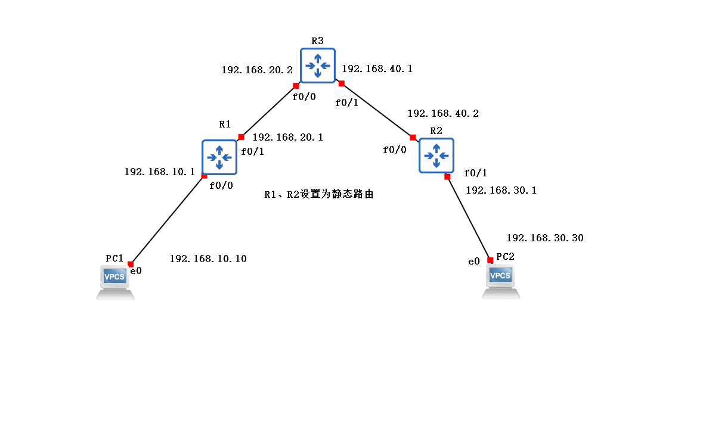

# 静态路由

以R3为例，

1. 设置端口ip地址

   > config t # 进入全局设置模式
   >
   > int f0/1 # interface fastethernet 0/1
   >
   > ip add 192.168.40.1 255.255.255.0 # ip地址 子网掩码
   >
   > no shut # 启动端口

2. 设置静态路由

   > f0/1 通过192.168.40.2到达192.168.30.1
   >
   > ip route 192.168.30.0 255.255.255.0 192.168.40.2

3. 查看路由表

   > do show ip route

PC

1. 设置ip地址

   > ip 192.168.10.10 255.255.255.0 192.168.10.1
   >
   > 网关为192.168.10.1